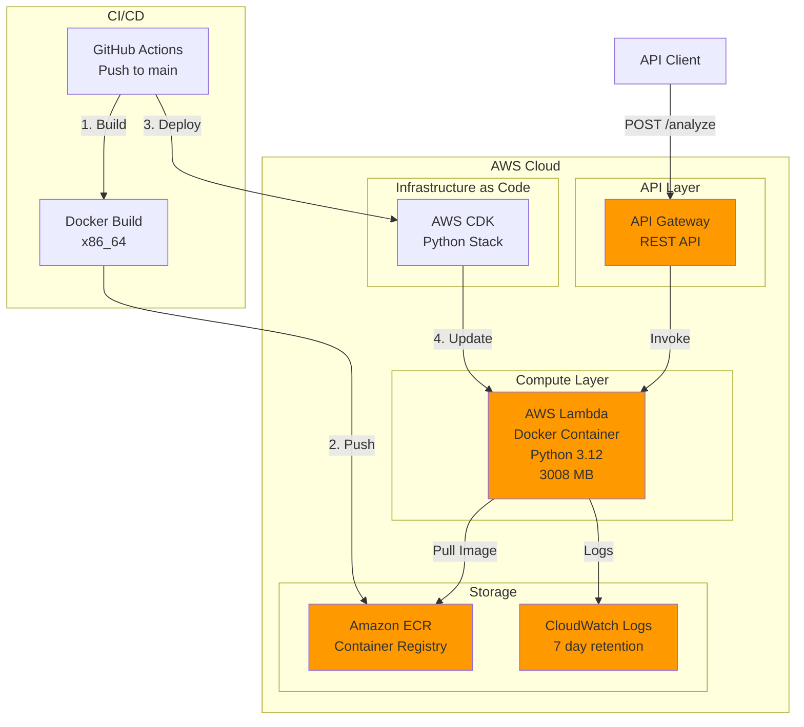
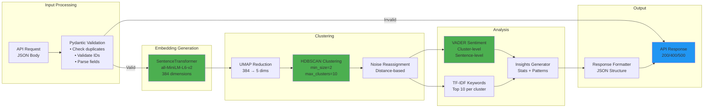
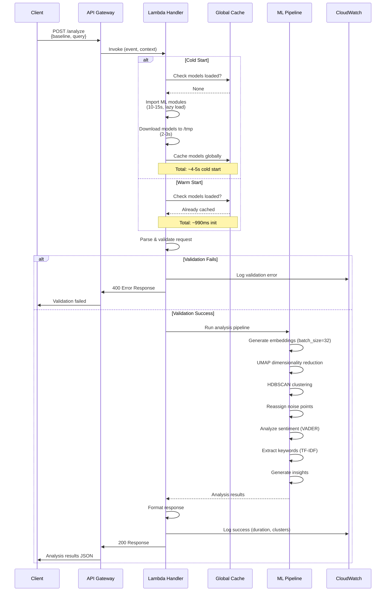
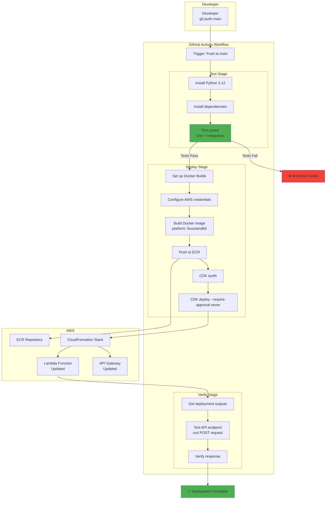
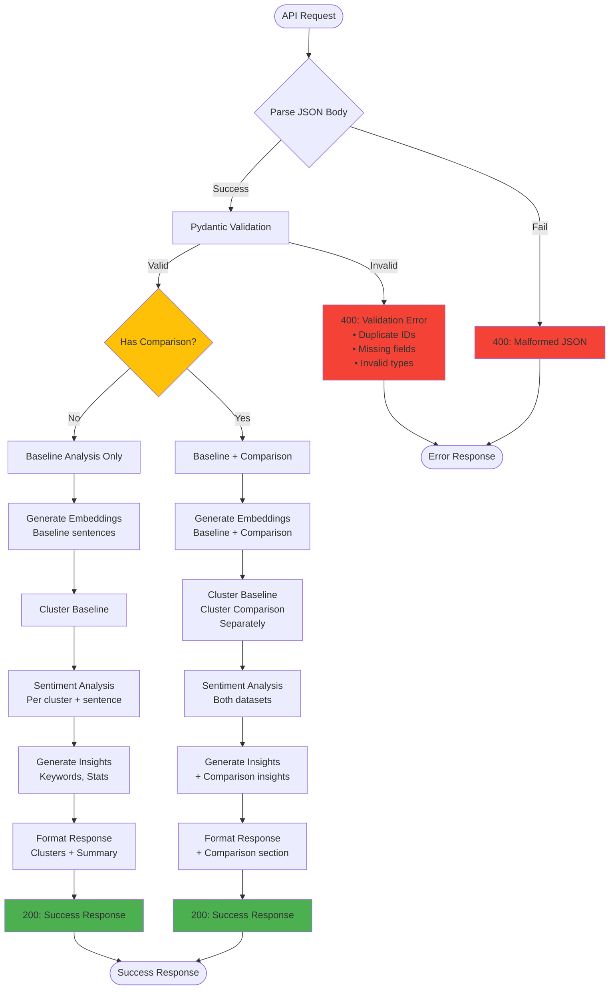
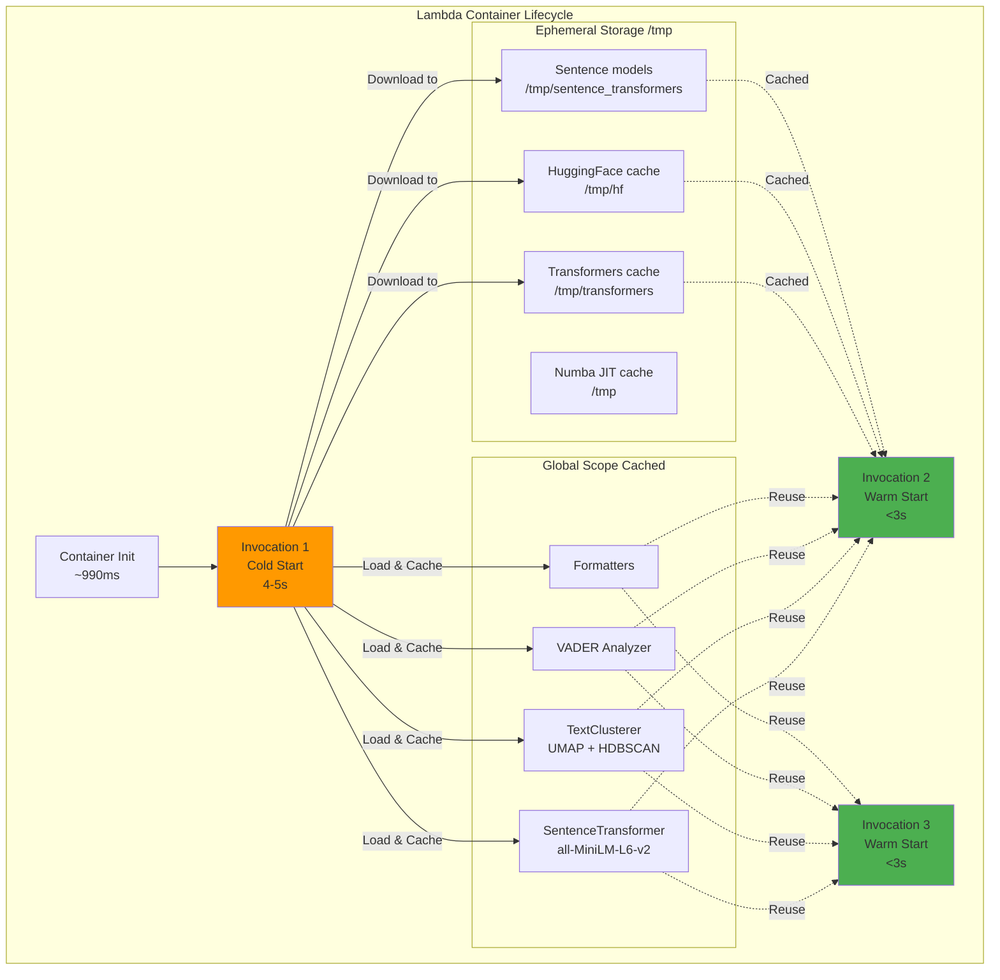
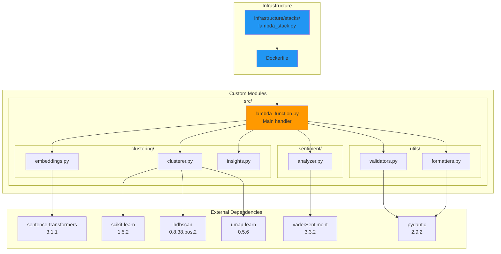
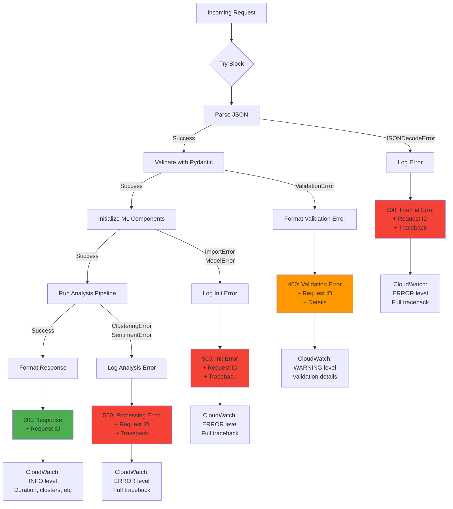
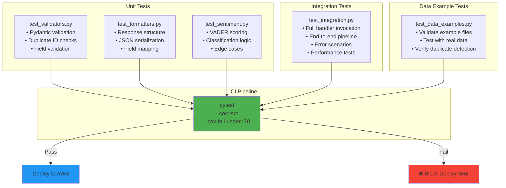
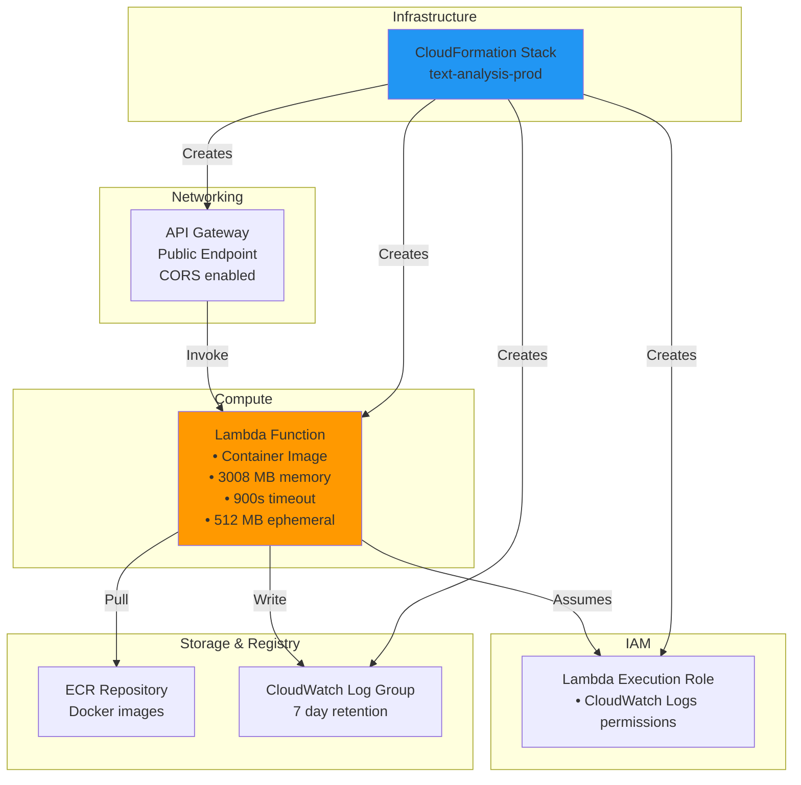

# System Architecture Diagrams

## 1. High-Level Architecture

## 2. ML Pipeline Architecture

## 3. Lambda Execution Flow

## 4. Deployment Pipeline

## 5. Data Flow - Request Processing

## 6. Caching & Performance Strategy

## 7. Component Dependencies

## 8. Error Handling Flow

## 9. Testing Strategy

## 10. AWS Resource Relationships

---

## Diagram Explanations

### 1. High-Level Architecture
Shows the overall AWS infrastructure, deployment pipeline, and main components.

### 2. ML Pipeline Architecture
Details the complete machine learning processing pipeline from input to output.

### 3. Lambda Execution Flow
Sequence diagram showing cold vs warm starts and request processing flow.

### 4. Deployment Pipeline
GitHub Actions workflow stages from code push to production deployment.

### 5. Data Flow - Request Processing
Decision tree showing how different request types are processed.

### 6. Caching & Performance Strategy
Illustrates global scope caching and ephemeral storage usage for performance.

### 7. Component Dependencies
Shows all module dependencies and their relationships.

### 8. Error Handling Flow
Complete error handling strategy with logging and response codes.

### 9. Testing Strategy
Test organization and CI/CD integration.

### 10. AWS Resource Relationships
CloudFormation-managed resources and their interactions.

---

## Key Performance Metrics

| Metric | Cold Start | Warm Start |
|--------|-----------|------------|
| **Init Duration** | ~4-5s | ~990ms |
| **100 sentences** | ~7-8s total | <3s |
| **500 sentences** | ~14-15s total | <10s |
| **Memory Used** | ~2.8 GB | ~2.5 GB |

## Technology Stack Summary

| Layer | Technology | Version |
|-------|-----------|---------|
| **Runtime** | Python | 3.12 |
| **Compute** | AWS Lambda | Docker Container |
| **API** | API Gateway | REST API |
| **IaC** | AWS CDK | Python |
| **CI/CD** | GitHub Actions | - |
| **Embeddings** | sentence-transformers | 3.1.1 |
| **Clustering** | HDBSCAN + UMAP | 0.8.38.post2 / 0.5.6 |
| **Sentiment** | VADER | 3.3.2 |
| **Validation** | Pydantic | 2.9.2 |
